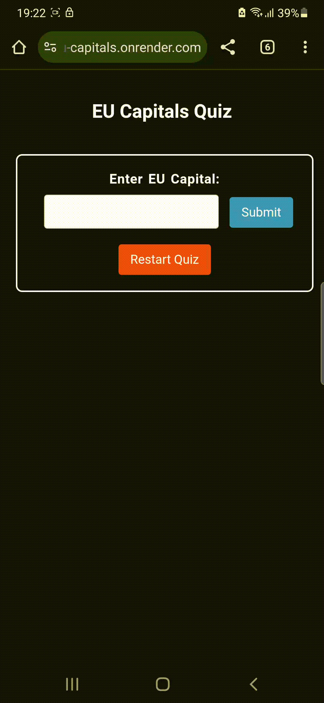

EU Capital Quiz App

  

Overview  

The EU Capital Quiz App is a full-stack web application designed to quiz users on EU capitals.  
The app provides information on a city based on user input, including confirmation of whether the city is an EU capital,  
population data, currency exchange rate (if applicable), and weather temperature.  

Project Goals  

This project started as a learning exercise to gain hands-on experience with making multiple API calls and real-world API integration.  
The primary goal was building a web application locally.  
Over time, it evolved into a full-stack app deployed on a cloud server.  
The application tracks quiz progress and provides detailed information about European Union capitals.  

Project Highlights  

Focused on real-world API integration.  
Demonstrates conditional logic based on user input.  
Tracks progress across 27 EU capitals.  
Fully deployed on a live server.  

Features  

City Input: Users can enter a city to check if it is an EU capital.  
EU Capital Confirmation: The app verifies if the city is an EU capital and displays relevant information.  
City Population: Displays the population of the city. (API call)  
Country Population: Each capital city is mapped to its corresponding country and country population data is displayed. (API call)  
Currency Exchange Rate: If the local currency is not Euro, the exchange rate to the Euro will be displayed. (API call)  
Weather Information: Displays the current weather in the city. (API call)  
Quiz Progress: Tracks quiz progress and shows previously answered cities.User progress is managed between sessions.  

Technologies Used  

* FastAPI: Web framework used to build the app.  
* Uvicorn: ASGI server for serving the FastAPI app.  
* aiohttp: For making asynchronous HTTP requests to external APIs.  
* python-dotenv: To securely load environment variables like API keys.  
* Jinja2: For rendering HTML templates.
* SessionMiddleware: Used to store and manage user progress between sessions.  
* requests: For standard HTTP requests.  
* itsdangerous: For cryptographic operations.  

Setup & Installation  

Since this is a live web application, there is no need for local installation.  
You can access the project at the following URL: https://quiz-eu-capitals.onrender.com  

Contributing  
Feel free to fork the repository and submit pull requests. Contributions are welcome!  

License  
This project is for educational purposes and open to the public.  
Licensed under the MIT License.  

Author  
Developed by m-peckus — learning back-end development one project at a time.  

